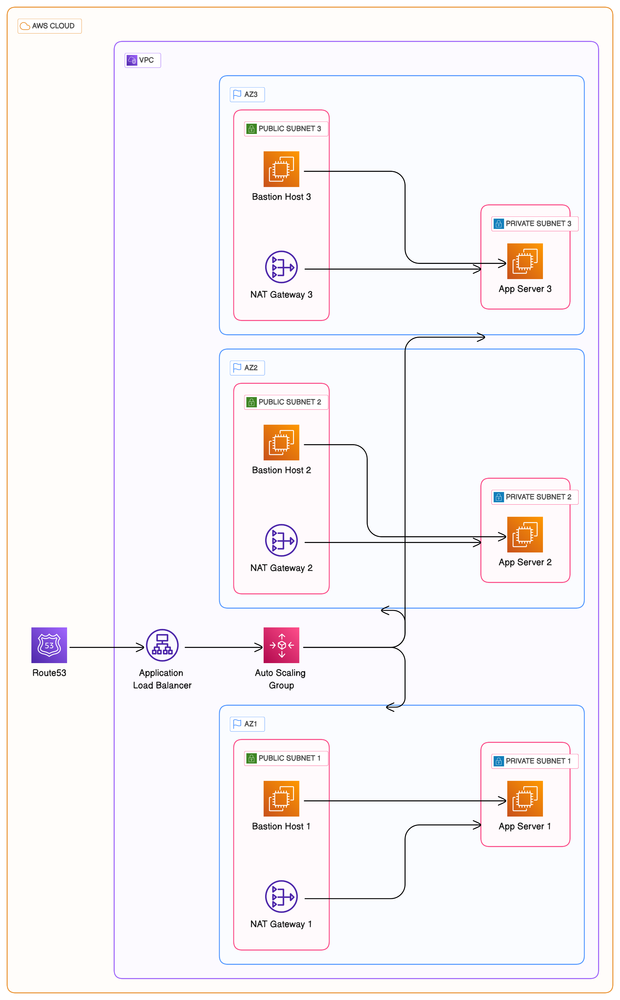

# aws_ha

This repo contains the config to deploy a java application on an EC2 instance in AWS autosaling group and it can be accessible by a domain backed by ALB in network-defined VPC. The app will be scale out and scale in based on the memory and cpu consumption to avoid significant costs and monitoring and alerts are in place. Also, the app servers can be accessed through bastion hosts in each AZ.

